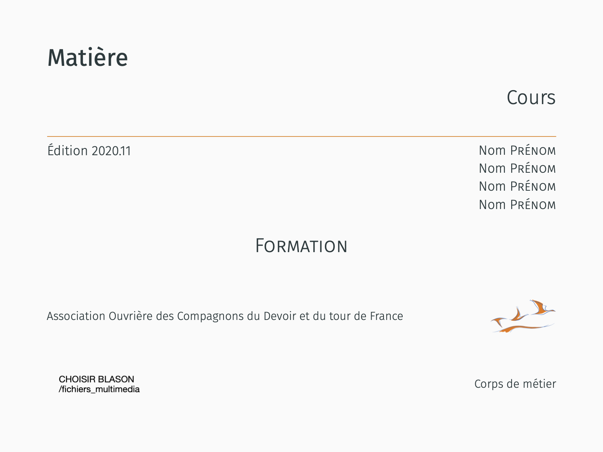

## Package AOCDTF 

LaTeX package for template to AOCDTF's educational content.

Ce dépôt contient les packages LaTeX nécessaire à la bonne compilation du template AOCDTF, dont les packages propriétaitres AOCDTF et AOCDTF_diaporama. Il s'agit de packages destinés à contenir les paramètrages précis du template AOCDTF. Ce dépôt a pour fonction de tenir aisément à jour les packages spécifiques au template AOCDTF.

| Page de couverture  | Page de titre | Page de titre du diaporama |
| :------------------: | :------------------: | :------------------: |
|  |  | |

# Etapes à effectuer

0. Maitriser les bases de la programmation sous l'environnement LaTeX et se familiariser avec le langage de versionnage Git :
- `commit/push` pour exporter en ligne les modifications dans une branche à son prenom_nom.
- `merge` pour intégrer ses modifications dans la branche "master"
- `pull` pour importer les modifications de la branche "master" (ou autre) depuis le dépôt Github

Divers documents de tutoriel pour tous les niveaux sont disponibles sur internet, avec entre autre : 
- [cours Openclassrooms](https://openclassrooms.com/fr/courses/5641721-utilisez-git-et-github-pour-vos-projets-de-developpement)
- tutoriel vidéo sur [Git et GitHub](https://www.youtube.com/watch?v=hPfgekYUKgk)
    
1. Installer 
 - LaTeX avec la distribution [TexLive](https://www.tug.org/texlive/)
 - Editeur [Texmaker](https://www.xm1math.net/texmaker/index_fr.html)

Voici une [documentation](https://vigou3.github.io/formation-latex-ul/) ultra-complète de l'université de Laval servant également pour la mise en route des outils
 
 - Gestionnaire de dépôt [GitKraken](https://www.gitkraken.com)
 - S'inscrire sur le site d'éditeur de dessin SVG (dessin vectoriel importable dans LaTeX) [Draw](https://www.draw.io)
 - Programme de gestion des bibliographie [Biber](http://biblatex-biber.sourceforge.net)
 - Editeur d'image en format vectoriel [Inkscape](https://inkscape.org/fr/)
 - Extracteur de données issues de graphiques [WebPlotDigitzer](https://automeris.io/WebPlotDigitizer/)
 - S'inscrire sur le site d'éditeur de dessin Tikz (code de dessin LaTeX) [Mathcha](https://www.mathcha.io/editor)

2. Importer le dépôt AOCDTF-package à l'aide de GitKraken dans l'emplacement des packages de la distribution TexLive :
`texlive/2020/texmf-dist/tex/latex` et ne pas oublier de mettre à jour la base de données des packages. Se référer aux instructions sur cette [page](https://latex.developpez.com/faq/?page=LaTeX-avance#Comment-installer-un-package-LaTeX), section _Comment installer un package LaTeX ?_ 

3. Si des modifications sont à ajouter au package AOCDTF ou au canevas, **consulter** l'équipe pour qu'on exporter ajouter ces modifications.

